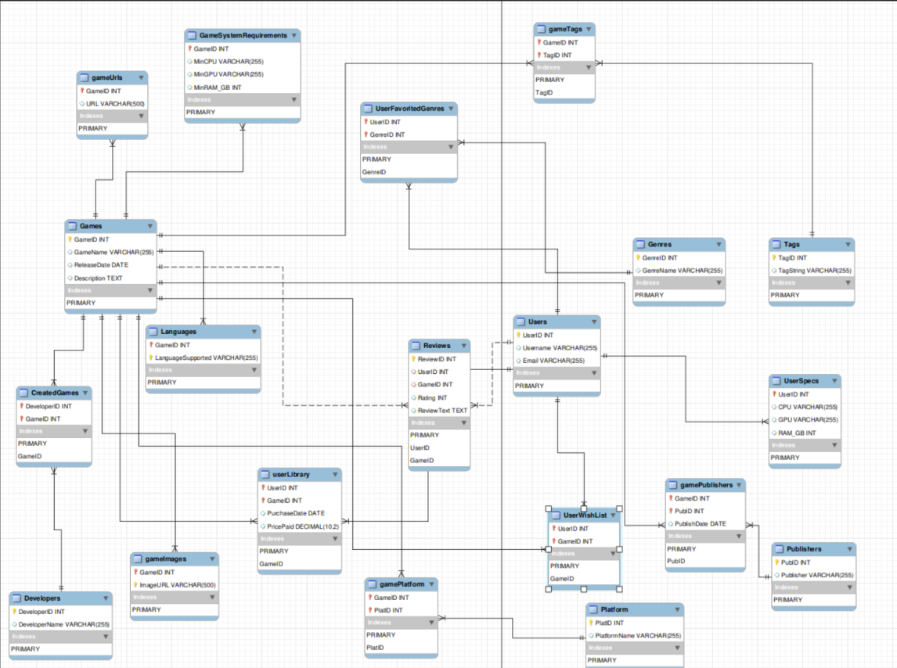

# Steam Reviewer  
*CS3620 Databases Final Project*

## Team Members
- Jayden Dowell
- Ethan Eisnaugle
- Patrick McConnell

---

## Project Overview

## Goal/Description of App
We are building a Steam game review and recommendation application that helps users discover PC games based on their preferences, budget, and system specifications. The application features:

- Browse and search Steam games with reviews
- Filter games by price/review
- See system requirements for each game
- Favorite games and add to wishlist
- Filter by your budget
- View reviews and ratings for each game
- View analytics for the game for a variety of stats:
  - Most Reviewed Games (through steam analytics)
  - Best Valued Game (Derived Calculations determined through price/rating)
  - Most Wishlisted Games (Using our own database of users)

---

## Application Interactions

### User Features
1. **Game Discovery**
   - Search games by name
   - Filter by price range (min/max or budget categories)
   - Sort by price, release year, or review count
   - View game details including price, rating, and system requirements

2. **Wishlist Management**
   - Add games to personal wishlist
   - View all wishlisted games with images
   - Remove games from wishlist

3. **Review Browsing**
   - Filter reviews by game or sentiment
   - Sort by date, playtime, or helpfulness
   - View detailed review statistics per game

4. **Analytics**
   - Explore curated lists of top games across different metrics
   - Discover trending and highly-rated titles
   - Find best value games for budget-conscious gamers

---

## Demo Video
[Watch Demo Video](LINK_TO_VIDEO_HERE)

---

## Database Design

### ER Diagram

### Key Entities
- **Games**: Core game information (name, price, release year, storage)
- **Reviews**: User reviews with sentiment and playtime data
- **GameSystemRequirements**: PC hardware requirements (CPU, GPU, RAM)
- **Users**: User accounts with budget preferences
- **UserWishList**: Many-to-many relationship between users and games
- **GameImages**: Steam CDN image URLs
- **GameUrls**: Links to Steam store pages

---

## Technology Stack
- **Frontend**: Next.js/React
- **Backend**: Django Framework with SQLite database
- **Database**: SQLite

---

## Datasets
- [Steam Game Reviews of 743 Games](https://www.kaggle.com/datasets/akashunikaggle/steam-game-reviews-of-743-games)
- [Steam Games Complete Dataset](https://www.kaggle.com/datasets/fronkongames/steam-games-dataset)
- [PC Videogame Requirements Dataset](https://www.kaggle.com/datasets/baraazaid/pc-video-game-requirements)
